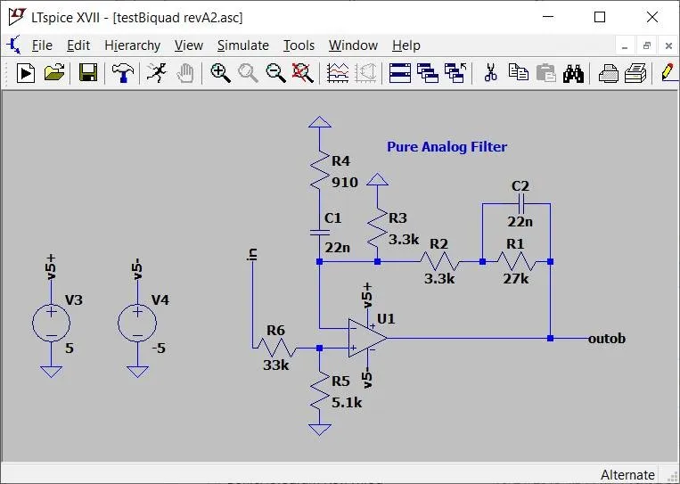

# Resources for Simulation

Welcome to the ITSP Resources page! Here you'll find essential tools and references to support your project development—from simulation and coding to design and testing. These resources are key to building, experimenting, and bringing your ideas to life effectively.

Whether you're setting up your first simulation environment, writing core code, or exploring different platforms for deployment, this page will help you get started. Make sure to explore each section and choose the tools that best fit your team's goals and workflow. Having the right resources at your fingertips can make all the difference.

Let’s dive into some of the most useful platforms across key domains—💡Circuitry, 🤖Robotics, 🦾Mechanics, and 💻Coding—to give your ITSP project the boost it deserves.

## 🤖 Robotic Simulation

Simulation environments for robotics allow you to prototype faster, refine algorithms in safety, and stress-test edge cases—all without having to physically build your robot every time something changes. Whether you're working on motion planning, control systems, or high-level autonomy, the right simulator helps bridge your design logic with real-world physics and constraints.

Each tool listed here brings its own strengths—from precise dynamics and sensor models to modular architectures that scale with complexity. If you're integrating ROS or testing out new hardware geometries, this is where the groundwork gets tested.

---

### **Gazebo** — Robust, ROS-Integrated Physics Simulation  
**Website:** [gazebosim.org](https://gazebosim.org/)  
**Platforms:** Linux, macOS (experimental), Windows (partial support)

Gazebo is one of the most widely used simulation tools in robotics, especially when working with ROS (Robot Operating System). It features a powerful physics engine, realistic rendering, and sensor emulation—all within a modular framework that supports both simple robots and large-scale multi-agent systems.

Thanks to tight integration with ROS, Gazebo is often used for iterative algorithm development, control loop validation, and autonomous behavior testing. You can simulate environments with obstacles, multiple robots, and real-world physics, making it a staple in research and advanced project pipelines.

Here are some resources to get you started: [Gazebo Docs](https://gazebosim.org/docs/latest/getstarted/)  
A great playlist to get you through the basics and some itermediates of gazebo: [YouTube Playlist](https://youtube.com/playlist?list=PLNw2RD-1J5YYvFGiMafRD_axHrBUGvuIg&si=nRWeBVM17BThw_yk)

  
  

    <em>A basic robot simulation in Gazebo Sim.</em>
  

---

### **Webots** — Feature-Rich 3D Simulation, Ideal for AI & Swarm Robotics  
**Website:** [cyberbotics.com](https://cyberbotics.com/)  
**Platforms:** Windows, Linux, macOS

Webots offers a clean, polished interface and a full-featured simulation environment where you can build, program, and test robots using built-in or custom models. It supports C, Python, Java, MATLAB, and ROS, and its physics engine is tuned for both accuracy and speed.

A particularly good fit for projects focusing on swarm robotics, reinforcement learning, or real-time feedback systems, Webots makes it easy to prototype and iterate rapidly—especially when dealing with multiple interacting robots.  

[Installation Guide](https://cyberbotics.com/doc/guide/installing-webots)  
Some resources to get you started: [Webots Docs](https://cyberbotics.com/doc/guide/tutorials)

  
  

    <em>Autonomous Car Simulation in Webots</em>
  

---

### **CoppeliaSim** — Flexible, Scriptable, and Plugin-Ready  
**Website:** [coppeliarobotics.com](https://www.coppeliarobotics.com/)  
**Platforms:** Windows, macOS, Ubuntu

CoppeliaSim (formerly V-REP) sets itself apart with a highly modular control architecture. You can embed scripts within each object in the environment, use remote APIs from your own code, or extend functionality through plugins. This makes it especially adaptable for hybrid control systems or when you want different parts of a robot to operate semi-independently.

The platform supports various physics engines and integrates with many robotic middleware systems, making it ideal for unconventional or research-oriented simulations. If your project architecture doesn’t fit a single “standard pipeline,” CoppeliaSim gives you room to experiment.

Some resources to get you started: [CoppeliaSim Tutorials](https://manual.coppeliarobotics.com/en/tutorials.htm)  
[More Resources](https://hades.mech.northwestern.edu/index.php/CoppeliaSim_Introduction)

  
  

    <em>Robot Simulation in CoppeliaSim</em>
  

---

### **MORSE** — Lightweight, Command-Line Driven Robotics Simulation  
**Website:** [openrobots.org/morse](https://www.openrobots.org/morse/doc/stable/morse.html)  
**Platforms:** Primarily Linux; limited Windows support

MORSE (Modular OpenRobots Simulation Engine) is a lesser-known but capable option, focused on scripting-driven simulations. Instead of building scenes manually, environments and scenarios are defined entirely using Python, giving you fine-grained control over both structure and behavior.

Best used in academic or research settings where you need lightweight control over agents and environments, MORSE excels in multi-robot scenarios, especially when integrating with higher-level decision-making frameworks like Blender, ROS, or middleware like YARP.

[Installation Guide](https://www.openrobots.org/morse/doc/stable/user/installation.html)  
Some resources to get you started: [MORSE Tutorials](https://www.openrobots.org/morse/doc/stable/tutorials.html)

  
  

    <em>Robot Simulation in MORSE</em>
  

---

### **AirSim** — Photorealistic Simulation for Drones, Cars & AI  
**Website:** [microsoft.github.io/AirSim](https://microsoft.github.io/AirSim/)  
**Platforms:** Windows, Linux, macOS

Built by Microsoft Research on Unreal Engine, AirSim is tailored for aerial and ground vehicle simulation. It provides detailed physics models, high-fidelity environments, and APIs for C++, Python, and even machine learning frameworks.

This is an excellent option if your project involves drones, autonomous cars, or AI-based navigation in realistic outdoor/indoor worlds. AirSim’s environments support both GPS-style navigation and pixel-perfect vision processing, making it ideal for CV-based obstacle detection, SLAM, or autonomous flight testing.

  
  

    <em>Drone Simulation in AirSim</em>
  

---

While robotic simulations help visualize movement and interaction, complex systems often need to be modeled at a higher level—where physical dynamics, control systems, and signal flow come into play. That’s where system-level simulators shine.

 

## ⚙️ Mechatronics & System Simulation

Designing complex systems often demands a multidisciplinary approach. Whether you're developing motor controllers, dynamic models, or feedback loops for physical systems, simulation tools in this space allow you to predict, test, and optimize before hardware is ever built.

This category of software bridges the gap between mechanical design, electrical actuation, and embedded logic—offering modeling techniques that range from block diagrams to equation-based systems. If your work involves electromechanical integration or control-heavy architectures, these tools are the backbone of rapid prototyping.

---

### **MATLAB Simulink** — Industry-Standard for Dynamic System Modeling  
**Website:** [mathworks.com/products/simulink](https://in.mathworks.com/products/simulink.html)  
**Platforms:** Windows, Linux, macOS  
**Availability:** Free via IITB student license

Simulink, built on top of MATLAB, is a visual environment for simulating and modeling dynamic systems using block diagrams. It allows you to drag-and-drop components like integrators, gain blocks, or transfer functions to model systems ranging from DC motors to inverted pendulums and beyond.

Because of its real-time simulation capabilities and deep integration with embedded code generation, Simulink is widely used in both academia and industry. If your work includes system-level behavior like PID tuning, real-time control, or plant modeling, this is likely your first stop.

[Installation Guide](./assets/Installation_of_MATLAB_and_Simulink.pdf)  
[Getting started with Simulink](https://youtube.com/playlist?list=PL484BA2AD3AE4C2D0&si=RrYuyr39r_VnLaIM)

  
  

    <em>Models in Simulink</em>
  

---

### **Scilab + Xcos** — Free and Open-Source Alternative to Simulink  
**Website:** [scilab.org](https://www.scilab.org/)  
**Platforms:** Windows, Linux, macOS

Scilab is a high-level numerical computation platform, and Xcos is its companion block-diagram simulation tool. The layout and function of Xcos are reminiscent of Simulink, making it an ideal entry point for those looking to model continuous and discrete systems without proprietary software.

If your project involves control design, signal processing, or even electrical-mechanical interaction, Xcos can provide many of the same capabilities as Simulink—without the licensing constraints. Its flexibility makes it suitable for initial experimentation and iterative modeling.

[Installation Guide](./assets/Scilab-Installation-Sheet-English.pdf)  
Some resources to get you started: [Scilab Tutorials](https://www.scilab.org/tutorials)

  
  

    <em>Models in Scilab</em>
  

---

### **OpenModelica** — Equation-Based, Acausal Modeling Environment  
**Website:** [openmodelica.org](https://openmodelica.org/)  
**Platforms:** Windows, Linux, macOS

Unlike block-based tools, OpenModelica lets you describe systems using actual mathematical equations. This “acausal” modeling approach means you don’t have to define signal flow explicitly—just the relationships between physical quantities like voltage, current, force, and displacement.

Ideal for multi-domain physical modeling, OpenModelica shines when you're working with coupled systems—like thermal-electrical-mechanical integration. It’s especially powerful for systems that don't fit neatly into input-output paradigms, and its textual modeling also encourages clean version control and modular reuse.

[Installation Guide](./assets/OpenModelica-Installation-Sheet-English.pdf)  
Some video tutorials: [Video Tutorials](https://spoken-tutorial.org/tutorial-search/?search_foss=OpenModelica&search_language=English)

  
  

    <em>Connection Editor in OpenModelica</em>
  

---

### **SimScale** — Cloud-Based FEA & CFD Simulation  
**Website:** [simscale.com](https://www.simscale.com/)  
**Platform:** Web-based

SimScale stands out as a fully cloud-native platform focused on **Computational Fluid Dynamics (CFD)** and **Finite Element Analysis (FEA)**. This is where you go if your project demands airflow simulation, stress-strain evaluation, or heat transfer analysis.

With no software installation required, SimScale enables simulations directly from your browser—making it perfect for testing chassis deformation, cooling systems, or aerodynamics. Its intuitive workflows and online community templates speed up your setup process significantly.

Some resources to help you get started: [SimScale Tutorials](https://www.simscale.com/docs/tutorials/)

  
  

    <em>Model in SimScale</em>
  

---

Of course, no system functions in isolation. At some point, signals travel through circuits, sensors interact with the environment, and electronics drive the logic underneath. These next tools help you bring those aspects into focus.  

 

## ⚡ Circuit & Electronics Simulation

Whether you're working on power regulation, signal conditioning, or sensor interfaces, circuit simulation is a vital part of verifying your designs before any hardware gets soldered. The tools in this section offer everything from quick prototyping environments to detailed, industry-grade analysis platforms. They're especially helpful when working on embedded systems or integrating microcontrollers with analog components.

These simulators let you test how your circuits behave under different loads, signal frequencies, or component tolerances—all without burning a single resistor.

---

### **LTspice** — Industry-Grade SPICE Simulation, Made Free  
**Website:** [analog.com - LTspice](https://www.analog.com/en/resources/design-tools-and-calculators/ltspice-simulator.html)  
**Platforms:** Windows, macOS

LTspice, developed by Analog Devices, is one of the most trusted circuit simulators in the electronics world. It provides precise and highly optimized SPICE-based simulation for analog, digital, and mixed-signal circuits. If you're building amplifiers, filters, power supply stages, or sensor interfaces, this is a solid go-to.

What sets LTspice apart is its balance of power and accessibility. You can run detailed transient, AC, DC, and noise analyses with relative ease, and its vast library of components includes accurate models for real-world parts. Ideal for precision-oriented projects where stability, response, or efficiency is key.

[Installation Guide](./assets/LTspice%20Tutorial%20Part%201%20-%20Download%20and%20installation.pdf)  
Some resources to get you started: [LTspice Tutorials](https://learn.sparkfun.com/tutorials/getting-started-with-ltspice/all)

  
  

    <em>Circuit Design in LTspice</em>
  

---

### **Falstad Circuit Simulator** — Visual, Fast, and Interactive  
**Website:** [falstad.com/circuit](https://falstad.com/circuit/)  
**Platforms:** Web-based

Sometimes you just need a fast way to check how a circuit behaves. Falstad’s online simulator is perfect for rapid experimentation. Its interactive, animated interface shows real-time voltage, current, and signal behavior—ideal for grasping intuition and debugging smaller circuits.

While it lacks the advanced analysis capabilities of tools like LTspice, its ease of use and instant feedback make it a surprisingly effective platform for prototyping ideas, testing simple configurations, or demonstrating concepts visually.

[Manual](./assets/falstad_manual.pdf)

  
  

    <em>Circuit Simulation in Falstad</em>
  

---

### **QUCS (Quite Universal Circuit Simulator)** — Especially Useful for RF & Analog Design  
**Website:** [qucs.sourceforge.net](https://qucs.sourceforge.net/)  
**Platforms:** Windows, Linux, macOS

QUCS focuses on circuit simulation for more specialized domains, such as RF, analog, and microwave systems. It offers a schematic editor and a powerful backend that can simulate everything from transmission lines to filter networks.

The interface feels a bit dated, but the analysis capabilities are impressive—especially when you’re working with S-parameters, impedance matching, or frequency-domain behavior. A good choice for those exploring communications, audio systems, or advanced analog work.

[Installation Guide](https://qucs.sourceforge.net/install.html)  
Some resources to get you started: [QUCS Tutorial](./assets/qucs_tutorial.pdf)

  
  

    <em>Circuit Simulation in QUCS</em>
  

---

### **EasyEDA** — Cloud-Based Schematic + PCB + SPICE  
**Website:** [easyeda.com](https://easyeda.com/)  
**Platforms:** Web-based

EasyEDA combines multiple aspects of electronics design—schematic creation, circuit simulation, and PCB layout—into a single, web-based interface. Its clean workspace, component library, and integration with the LCSC parts database make it one of the most streamlined platforms for bringing a design from concept to board.

SPICE simulation is built-in, so you can model behavior before moving to layout. Plus, collaboration is seamless—especially useful if you're working in a team and need to iterate quickly across circuit revisions. When you're ready to manufacture, EasyEDA can even connect you directly to PCB fab services.

[Complete Tutorial](./assets/EasyEDA-Tutorial_v6.4.32.pdf)

  
  

    <em>PCB builder in EasyEDA</em>
  

---

Once the circuit design is sound, it's time to bring it to life with logic and code. Microcontroller simulation tools let you prototype firmware and embedded logic even before your hardware arrives.

 

## 🧠 Embedded & Microcontroller Simulation

When you're working with embedded systems, direct hardware access isn’t always possible—or practical. That’s where microcontroller simulation tools come in. These platforms allow you to test firmware, experiment with I/O, and validate timing or logic errors without burning code onto physical chips.

Whether you're building sensor fusion systems, communication protocols, or motor control routines, simulated environments help speed up the development cycle while catching mistakes early. Each tool listed here offers a different balance between ease of use, extensibility, and realism.

---

### **Wokwi** — Fast, Accessible Arduino/ESP32 Simulation  
**Website:** [wokwi.com](https://wokwi.com/)  
**Platform:** Web-based, or via VSCode extension

Wokwi provides a smooth and fast way to simulate microcontroller setups, especially those based on Arduino or ESP32 boards. With a clean drag-and-drop UI and code editor, it lets you wire components virtually and run your C++ code instantly—right in the browser.

It’s perfect for quick validation of logic, testing sensor data flow, or visualizing control behavior. While advanced sensor libraries and hardware integration are limited in the free tier, Wokwi’s convenience makes it ideal for early prototyping and iterative testing.

Some resources to get you started: [Wokwi Docs](https://docs.wokwi.com/)

  
  

    <em>Arduino Simulation in Wokwi</em>
  

---

### **Tinkercad Circuits** — Visual Coding + Hardware Simulation  
**Website:** [tinkercad.com/circuits](https://www.tinkercad.com/circuits)  
**Platform:** Web-based

Built by Autodesk, Tinkercad Circuits is a beginner-friendly simulation tool that combines block-based logic (think Scratch) with actual C-style coding. It supports virtual Arduino boards and a limited set of components like LEDs, buttons, and simple sensors.

While it may not scale well for complex projects, it's a fantastic sandbox for logic design, basic coding, and understanding serial input/output behavior. It’s especially useful for testing ideas quickly before wiring up a real breadboard.

[Official Guide](https://www.tinkercad.com/blog/official-guide-to-tinkercad-circuits)

  
  

    <em>Arduino Simulation in Tinkercad Circuits</em>
  

---

### **SimulIDE** — Intermediate Circuit + MCU Simulator  
**Website:** [simulide.com](https://simulide.com/p/)  
**Platforms:** Windows, Linux, macOS

SimulIDE offers a middle ground—more capable than Wokwi or Tinkercad, but less complex than professional tools like Proteus. It supports real-time simulation of microcontrollers (like AVR, PIC), and allows visual debugging via scopes and serial monitors.

For embedded projects involving both circuit-level interactions and logic development, SimulIDE gives enough power to test communication protocols, timing dependencies, and multi-component interaction without steep learning curves.

[Quick Start Guide](https://pcotret.github.io/simulide/)

  
  

    <em>Arduino Simulation in Simulide</em>
  

---

### **Proteus VSM** — Professional-Grade Microcontroller Simulation  
**Website:** [labcenter.com](https://www.labcenter.com/)  
**Platform:** Windows-only

Proteus Virtual System Modelling (VSM) is a comprehensive platform combining circuit simulation with actual microcontroller emulation. It allows you to load compiled HEX or ELF files and run them as if on real hardware—complete with scope visualization, interrupts, and peripheral interaction.

It’s especially useful for debugging complex embedded systems with tight real-time constraints or critical timing loops. While it has a steeper learning curve and requires a license (though the free version has plenty capabilities), Proteus is unmatched for deep system-level debugging before deployment.

[Installation Guide](https://www.geeksforgeeks.org/installation-guide/how-to-download-and-install-proteus-software-on-windows/)  
[Usage Guide](https://www.geeksforgeeks.org/installation-guide/how-to-download-and-install-proteus-software-on-windows/)

  
  

    <em>Microcontroller Simulation in Proteus 8</em>
  

---

Many projects involve physical movement or structural components—whether it's a robotic chassis or a simple gear system. That’s where mechanical design tools come into play, bridging the gap between digital logic and real-world form.

 

## 🛠️ CAD/Mechanical Design Tools

Design is often the bridge between your concept and its physical realization. Whether you're building chassis, linkages, enclosures, or full mechanical assemblies, CAD (Computer-Aided Design) tools provide the structure and precision required to iterate and manufacture with confidence.

This section highlights accessible yet powerful design platforms that allow teams to visualize, refine, and test mechanical systems before 3D printing, laser cutting, or fabricating them in the workshop.

---

### **Fusion 360** — Cloud-Based 3D CAD with Simulation and CAM  
**Website:** [autodesk.com/fusion360](https://www.autodesk.com/products/fusion-360/overview)  
**Platform:** Windows, macOS (Cloud-sync enabled)  
**Note:** Free with IITB Educational Account

Fusion 360 offers an integrated environment that brings together sketching, parametric modeling, assembly design, simulation, CAM, and rendering—all within a single interface. Its real strength lies in cloud collaboration and built-in tools that help streamline workflows from design to manufacturing.

Whether you're laser-cutting a gear train or simulating the stress on a robotic arm, Fusion 360 scales with your ambition. With version history, real-time collaboration, and tools like generative design and finite element analysis (FEA), it’s a solid choice for teams looking to prototype fast and iterate often.

[Official Tutorials](https://help.autodesk.com/view/fusion360/ENU/?guid=GUID-670346CA-4CF8-4009-9E9B-09FCC6803B61)

  
  

    <em>3D Design in Fusion 360</em>
  

---

### **FreeCAD** — Modular Open-Source Parametric Design  
**Website:** [freecadweb.org](https://www.freecadweb.org/)  
**Platforms:** Windows, Linux, macOS

FreeCAD is a community-driven alternative that brings robust parametric modeling to anyone who prefers local software and full control. Its modular design supports everything from mechanical parts to electronics enclosures to architectural designs, depending on what workbenches you activate.

Although its UI may feel rougher compared to commercial tools, FreeCAD’s Python scripting support and extensive plugin ecosystem make it surprisingly flexible. Ideal if you're working on very specific workflows or need a customizable design tool without cloud dependency.

[Linux Installation](https://wiki.freecad.org/Installing_on_Linux)  
[Windows Installation](https://wiki.freecad.org/Installing_on_Windows)  
[macOS Installation](https://wiki.freecad.org/Installing_on_Mac)  
 
[Tutorials](https://spoken-tutorial.org/tutorial-search/?search_foss=FreeCAD&search_language=English)

  
  

    <em>3D Design in FreeCAD</em>
  

---

Finally, all these tools need a foundation of code—whether you're building control logic, scripting simulations, or debugging firmware. These environments help you write, test, and manage that code efficiently.

 

## 💻 Coding & Scripting Environments

At the heart of any functional prototype lies code—whether it’s controlling actuators, handling sensor input, or processing logic on embedded platforms. A well-chosen development environment can make or break your workflow, especially when debugging under pressure or collaborating across your team.

Below are versatile tools that go beyond basic editors. They help structure your codebase, manage libraries, and integrate with version control and simulators—streamlining the entire embedded or system software development process.

---

### **Arduino IDE** — Simple and Direct for Microcontroller Development  
**Website:** [arduino.cc](https://www.arduino.cc/en/software)  
**Platforms:** Windows, Linux, macOS

The Arduino IDE has long been the go-to environment for working with AVR-based boards like the Uno, Nano, or Mega. It features a straightforward interface, minimal setup, and plug-and-play support for uploading code via USB.

While it’s minimal in features, it supports quick testing, real-time serial monitoring, and community-contributed libraries that simplify complex tasks—from reading sensors to controlling motors. Ideal for lightweight or single-board projects where fast iterations matter more than advanced debugging.

[Official Tutorials](https://www.arduino.cc/en/Tutorial/HomePage/)

  
  

    <em>Sample Code in Arduino IDE</em>
  

---

### **PlatformIO** — Full-Stack Embedded Development Environment  
**Website:** [platformio.org](https://platformio.org/)  
**Platform:** Works as a VS Code extension (cross-platform)

PlatformIO is a modern alternative that scales up your development stack. It supports a wide range of microcontrollers—from Arduino and ESP32 to STM32 and RP2040—and provides features like IntelliSense, task automation, version control integration, and even unit testing.

Perfect for multi-file projects and when you're collaborating on firmware across a team. PlatformIO also manages library dependencies cleanly and allows multiple environments in a single workspace—making it a favorite for those looking to go beyond basic IDEs.

[Installation Guide](https://docs.platformio.org/en/latest/core/installation/index.html)  
[Official Tutorials](https://docs.platformio.org/en/latest/tutorials/index.html)

  
  

    <em>PlatformIO in VS Code</em>
  

---

Together, Arduino IDE and PlatformIO offer a spectrum—from simplicity to scalability. Depending on how much structure your project needs and how many platforms you’re targeting, choosing the right tool can improve both development speed and code quality.

---

### Whether you're simulating sensor behavior, drafting mechanical components, or testing microcontroller logic, the right tools can give your ideas momentum and structure. These resources aren’t just about convenience—they’re about building with intention. Choosing thoughtfully and integrating well can turn rough concepts into working systems faster, with fewer dead ends along the way. Explore, adapt, and make the most of what fits your workflow best.

---

